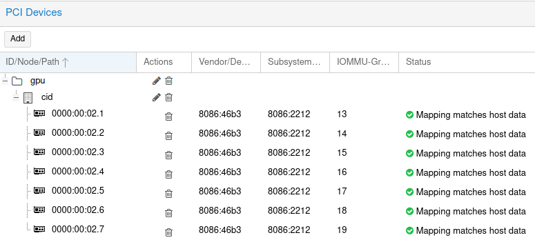

Terraform modules, Helm charts, and some docker-compose files for running my `homelab`.

This consists of several services including (but not limited to):

 - PiHole
 - Plex
 - Photoprism
 - Logitech Media Server (LMS)
 - Unifi Controller
 - Media organization:
    - Radarr
    - Sonarr

I consider this lab a production environment, as it runs services which my family relies upon (namely, Photoprism).

Terraform modules can be found in [`tf`](./tf) and drive the majority of this setup. I run everything in a 3-node k8s cluster (Thinkcenter m900s). V1 of the lab was split into `docker-compose` and `k8s`, but with V2 I am migrating everything to `k8s` for simplicity. This is still an ongoing process.

# Proxmox

Leveraging Proxmox to further simplify and automate my lab for the current iteration (v2.5?), there are a few things to do manually to set up a Proxmox host.

## Ventoy

If using Ventoy to install, the `linux` line of your grub config may capture Ventoy's ramdisk config, rendering your new Proxmox node unbootable. To resolve this, hit `e` on the Grub entry, scroll down to the `linux=` line, and remove the `rdinit=vtoy/vtoy` bit from the end of that line. Hit `C-x` to save and boot.

Once booted, you'll need to: `rm /etc/default/grub.d/installer.cfg` and run `update-grub`

## Tailscale

I have a [Tailnet](https://tailscale.com) for managing my LAN remotely, so I installed Tailscale on all my Proxmox hosts as per the instructions.

## VLAN-aware networking

If you use VLANs, make sure to enable VLAN-aware networking for your bridged interface in Proxmox:

1. Select your server.
2. Go to “Network” in the menu.
3. Select the Linux bridge (vmbro#).
4. Click “Edit” at the top of the window.
5. Check the box that says “VLAN aware”
6. Press “OK.”

## iGPU passthrough

This has been covered elsewhere, so I will leave a couple links to reference [here](https://www.michaelstinkerings.org/gpu-virtualization-with-intel-12th-gen-igpu-uhd-730/) and [here](https://github.com/Upinel/PVE-Intel-vGPU). Note the steps for installing the DKMS modules on the guests have been wrapped into my `cluster` Terraform module.

### Mapping

You will have to map the device as a resource to be able to use this Terraform module to deploy, as Proxmox will not allow raw PCI configuration via API. To do this, head to _Datacenter -> Resource Mappings_ in the Proxmox GUI and hit _Add_. Map your fractionalized GPUs in, giving them a name which you will refer to in your config.



## VM Image

Since most of the guides ([1](https://techbythenerd.com/posts/creating-an-ubuntu-cloud-image-in-proxmox/), [2](https://www.norocketscience.at/blog/terraform/deploy-proxmox-virtual-machines-using-cloud-init)) I have been referencing use Ubuntu, I stuck with the Ubuntu Cloud images for this install. To prep a template, you must basically do this:

```sh
wget https://cloud-images.ubuntu.com/oracular/current/oracular-server-cloudimg-amd64.img
qm create 9000 --name "ubuntu-2410-cloudinit-template" --memory 2048 --net0 virtio,bridge=vmbr0
qm importdisk 9000 oracular-server-cloudimg-amd64.img local-lvm
qm set 9000 --scsihw virtio-scsi-pci --scsi0 local-lvm:vm-9000-disk-0
qm set 9000 --ide2 local-lvm:cloudinit
qm set 9000 --boot c --bootdisk scsi0
qm set 9000 --serial0 socket --vga serial0
qm template 9000
```

### iGPU template

You will need to further customize the previously-created template for iGPU passthrough. Create a VM from this template, ensuring you set the BIOS to UEFI, machine type to `q35`, and expand the HDD (10GB should be fine).

Finally, install the DKMS module into the VM:

```sh
export SRVIO_DKMS_VERSION="2025.02.03" # see https://github.com/strongtz/i915-sriov-dkms/releases for the latest. This should match what you installed on the Proxmox host above

sudo -E apt install dkms build-* linux-headers-$(uname -r) linux-modules-extra-$(uname -r) -y
wget https://github.com/strongtz/i915-sriov-dkms/releases/download/${SRVIO_DKMS_VERSION}/i915-sriov-dkms_${SRVIO_DKMS_VERSION}_amd64.deb
sudo -E apt install ./i915-sriov-dkms_${SRVIO_DKMS_VERSION}_amd64.deb -y

echo "blacklist xe" | sudo -E tee -a /etc/modprobe.d/blacklist.conf
echo "options i915 enable_guc=3" | sudo -E tee -a /etc/modprobe.d/i915.conf

sudo -E update-grub

sudo -E apt-get clean \
&& sudo -E apt -y autoremove --purge \
&& sudo -E apt -y clean \
&& sudo -E apt -y autoclean \
&& sudo -E cloud-init clean \
&& echo -n | sudo -E tee /etc/machine-id \
&& echo -n | sudo -E tee /var/lib/dbus/machine-id \
&& sudo -E sync \
&& history -c \
&& history -w \
&& sudo -E fstrim -av \
&& sudo -E shutdown now
```

Now, back on your Proxmox host, convert the VM to a new template:

```
qm template <vmid>
```

## cloudinit

It is useful to install the qemu guest agent on your VMs. You can easily do this with `cloudinit` by [creating a snippet](https://registry.terraform.io/providers/Telmate/proxmox/latest/docs/guides/cloud-init%2520getting%2520started#creating-a-snippet). The VMs created by this module will expect this snippet to exist.

## k3s

The entire purpose of this is to run k8s in the form of k3s on top. I really like [this project](https://github.com/fvumbaca/terraform-proxmox-k3s), save for two things:

1. I don't care about separating `master` and `worker` nodes in my cluster
2. I need to map the GPU and will eventually want to add multiple NICs for VLAN support on my k8s nodes

Given those constraints, I have shamelessly copied most of @fvumbaca's Terraform into this repo and modified it for my own purposes. Note I also had to bring it up-to-date with the latest version of the Proxmox TF provider.

---- 

# V1 README

Everything below was from the V1 README. I am leaving it in here while I migrate to my V2 config. Some of this will remain but most will disappear.

The configuration here is divided into three directories:

 - `k8s`
 - `docker`
 - `edge`

Services which only need to be accessed from my LAN are run via `docker-compose`. Anything that is public-facing is in a `k8s` cluster. Public access is provided via reverse proxy on a Linode server attached to my Tailscale network. Each service behind this proxy has individual login (for now, it's only Photoprism).

# Terraform Variables

This repo contains the Terraform modules. I am running `terragrunt` from the env directories (i.e. `prod/k8s`), so variables are set using `TF_VAR_foo` in a `direnv` file. In the future, I may split the modules from the configuration to add those variables to (private) source control.

# Docker Variables

    export HOST=
    export TIMEZONE=
    export PUID=
    export PGID=
    export PLEX_ADVERTISE_IP=
    export MUSIC_DIR=
    export MOVIE_DIR=
    export TV_DIR=
    export PLAYLIST_DIR=
    export PIHOLE_PASSWORD=
    export PIHOLE_IP=

# Requirements

Docker and Docker Compose.

This configuration assumes you have a `k3s` cluster deployed with the default Traefik and load balancer configuration. Your `~/.kube/config` should be configured to access this cluster.

# Routing

Routing is achieved via wildcard hostnames: `app.*`. This allows apps to live at a relative root path.

# Environment Variables

| Variable | Description |
|----------|-------------|
| `AWS_ACCESS_KEY_ID` | Used to connect to AWS S3 to store Terraform's State |
| `AWS_SECRET_ACCESS_KEY` | Used to connect to AWS S3 to store Terraform's State |

# Usage

    cd prod/k8s
    terragrunt run-all apply
    cd ../docker
    docker-compose up -d

# TODO

- [x] cert-manager / public access (via edge)
- [ ] Traefik AUTH
- [x] Plex
    - [x] Volume mounts
    - [x] Transcoding
- [x] PiHole
- [x] Photoprism
- [x] Secondary Photoprism (sister-in-law - necessary because Photoprism doesn't yet have multiple library support)
- [x] LMS
- [ ] Family dashboard
    - not sure what to do here yet...maybe a custom MagicMirror?
- [ ] Backups
    - all locally mounted volumes (anything in `~/.docker`)
    - Photoprism (docker): `docker-compose exec -T photoprism photoprism backup -i - > photoprism-db.sql`
